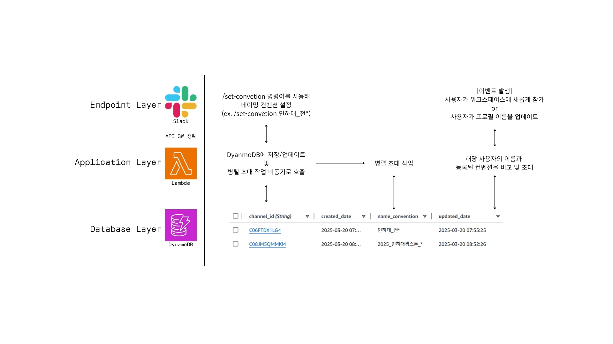

# Slack 채널 자동 초대 봇 프로젝트

이 프로젝트는 Slack 워크스페이스에서 사용자 이름 패턴에 따라 특정 채널에 자동으로 초대하는 시스템입니다. AWS Lambda, DynamoDB, Slack API를 활용한 서버리스 아키텍처로 구현되어 있습니다.

## 시스템 아키텍처

 아래와 같은 레이어로 구성됩니다:
- **엔드포인트 레이어**: Slack API (이벤트 및 명령어)
- **애플리케이션 레이어**: AWS Lambda Functions
- **데이터베이스 레이어**: Amazon DynamoDB

## 기능

1. 채널별 이름 컨벤션 설정 (`/set-convention` 명령어)
2. 새 사용자 가입 시 자동 채널 초대
3. 사용자 프로필 변경 시 자동 채널 초대
4. 와일드카드(`*`) 패턴 매칭 지원
5. 컨벤션 설정/변경 시 기존 사용자 일괄 초대

## 설치 및 설정 가이드

### 1. AWS 리소스 설정

#### DynamoDB 테이블 생성

1. AWS 콘솔에서 DynamoDB 서비스로 이동
2. "테이블 생성" 선택
3. 테이블 이름: `slack-invitor` (또는 원하는 이름)
4. 파티션 키: `channel_id` (문자열)
5. 기본 설정으로 테이블 생성

#### Lambda 함수 생성

세 개의 Lambda 함수를 생성해야 합니다:

1. **slack_invitor_convention**: 채널 컨벤션 설정 함수
2. **slack_invitor**: 사용자 이벤트 처리 함수
3. **slack_invitor_invite_all**: 모든 사용자 초대 함수

런타임: Python 3.9 이상 선택

#### Lambda 레이어 추가 (requests 라이브러리)

모든 Lambda 함수에 requests 라이브러리가 필요합니다:

1. [KLayers](https://api.klayers.cloud/api/v2/p3.12/layers/latest/ap-northeast-2/html)에서 ap-northeast-2 리전의 requests 레이어 ARN 확인
2. 각 Lambda 함수의 "레이어" 섹션에서 "레이어 추가" 클릭
3. "ARN 지정" 선택
4. 확인한 requests 레이어 ARN 입력
5. "추가" 클릭

#### 환경 변수 설정

각 Lambda 함수에 다음 환경 변수를 설정:

1. `SLACK_BOT_TOKEN`: Slack 봇 토큰 값
2. `DYNAMODB_TABLE`: DynamoDB 테이블 이름 (기본값: `slack-invitor`)

#### IAM 권한 설정

각 Lambda 함수에 필요한 IAM 권한:

1. **slack_invitor_convention**:
   - DynamoDB 읽기/쓰기 권한
   - Lambda 호출 권한
   - CloudWatch Logs 권한

2. **slack_invitor**:
   - DynamoDB 읽기 권한
   - CloudWatch Logs 권한

3. **slack_invitor_invite_all**:
   - DynamoDB 읽기 권한
   - CloudWatch Logs 권한

IAM 정책 예시:
```json
{
    "Version": "2012-10-17",
    "Statement": [
        {
            "Effect": "Allow",
            "Action": [
                "dynamodb:GetItem",
                "dynamodb:PutItem",
                "dynamodb:UpdateItem",
                "dynamodb:DeleteItem",
                "dynamodb:Scan"
            ],
            "Resource": "arn:aws:dynamodb:*:*:table/slack-invitor"
        },
        {
            "Effect": "Allow",
            "Action": [
                "lambda:InvokeFunction"
            ],
            "Resource": "arn:aws:lambda:*:*:function:slack_invitor_invite_all"
        },
        {
            "Effect": "Allow",
            "Action": [
                "logs:CreateLogGroup",
                "logs:CreateLogStream",
                "logs:PutLogEvents"
            ],
            "Resource": "*"
        }
    ]
}
```

### 2. Slack 앱 설정

#### Slack 앱 생성

1. [Slack API 웹사이트](https://api.slack.com/apps)에서 "Create New App" 클릭
2. "From scratch" 선택
3. 앱 이름과 워크스페이스 선택 후 "Create App" 클릭

#### 봇 권한 설정

"OAuth & Permissions" 섹션에서 다음 Bot Token Scopes 추가:

- `channels:read` - 채널 정보 읽기
- `channels:write` - 채널에 사용자 초대
- `chat:write` - 메시지 전송
- `commands` - 슬래시 명령어 사용
- `users:read` - 사용자 정보 읽기
- `groups:read` - 비공개 채널 정보 읽기
- `groups:write` - 비공개 채널에 사용자 초대

#### 슬래시 명령어 설정

"Slash Commands" 섹션에서 새 명령어 추가:

1. "Create New Command" 클릭
2. Command: `/set-convention`
3. Request URL: Lambda 함수의 API Gateway URL
4. Short Description: "채널의 이름 컨벤션을 설정합니다"
5. "Save" 클릭

#### 이벤트 구독 설정

"Event Subscriptions" 섹션에서:

1. "Enable Events" 활성화
2. Request URL: Lambda 함수의 API Gateway URL
3. "Subscribe to bot events" 섹션에서 다음 이벤트 추가:
   - `team_join` - 새 사용자 가입
   - `user_change` - 사용자 프로필 변경
4. "Save Changes" 클릭

#### 앱 설치 및 토큰 획득

1. "Install App" 섹션에서 "Install to Workspace" 클릭
2. 권한 요청 확인
3. 설치 후 "OAuth & Permissions" 섹션에서 "Bot User OAuth Token" 복사
4. 이 토큰을 Lambda 함수의 `SLACK_BOT_TOKEN` 환경 변수에 설정

### 3. API Gateway 설정

각 Lambda 함수에 대한 API Gateway 엔드포인트 생성:

1. AWS 콘솔에서 API Gateway 서비스로 이동
2. "API 생성" 클릭
3. "HTTP API" 선택
4. "통합 추가"에서 해당 Lambda 함수 선택
5. 메서드: POST
6. 리소스 경로: /slack-events 또는 /slack-commands
7. API 생성 후 URL 복사하여 Slack 앱 설정에 사용

## 사용 방법

### 채널 컨벤션 설정

채널에서 다음 명령어 사용:
```
/set-convention [패턴]
```

예시:
- `/set-convention dev*` - "dev"로 시작하는 모든 이름 (예: developer, devops)
- `/set-convention marketing` - "marketing"과 정확히 일치하는 이름만
- `/set-convention` (빈 값) - 해당 채널의 컨벤션 삭제

### 자동 초대 기능

설정 후 다음 상황에서 자동 초대가 작동합니다:
1. 새 사용자가 워크스페이스에 가입할 때
2. 기존 사용자가 프로필 이름을 변경할 때
3. 새 컨벤션이 설정되거나 기존 컨벤션이 변경될 때 (기존 사용자 대상)

## 코드 설명

### slack_invitor_convention.py
채널별 이름 컨벤션을 설정하는 Lambda 함수입니다. `/set-convention` 슬래시 명령어를 처리합니다.

### slack_invitor.py
사용자 이벤트를 처리하는 Lambda 함수입니다. 새 사용자 가입 및 프로필 변경 이벤트를 감지하고 처리합니다.

### slack_invitor_invite_all.py
컨벤션 설정/변경 시 기존 사용자를 일괄 초대하는 Lambda 함수입니다.

## 문제 해결

### 일반적인 문제

1. **channel_not_found 에러**
   - 봇이 채널에 초대되어 있는지 확인
   - 채널 ID가 올바른지 확인
   - 봇에 필요한 권한이 있는지 확인

2. **권한 부족 에러**
   - Slack 앱에 필요한 모든 권한이 설정되어 있는지 확인
   - Lambda 함수의 IAM 역할에 필요한 권한이 있는지 확인

3. **Lambda 함수 오류**
   - CloudWatch Logs에서 오류 메시지 확인
   - requests 라이브러리 레이어가 올바르게 추가되었는지 확인

## 라이선스

이 프로젝트는 MIT 라이선스 하에 배포됩니다. 자세한 내용은 LICENSE 파일을 참조하세요.